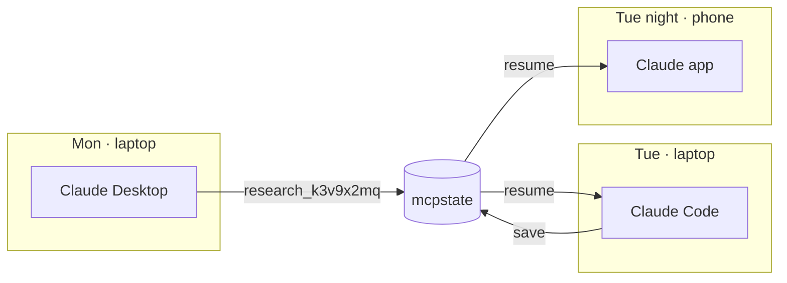
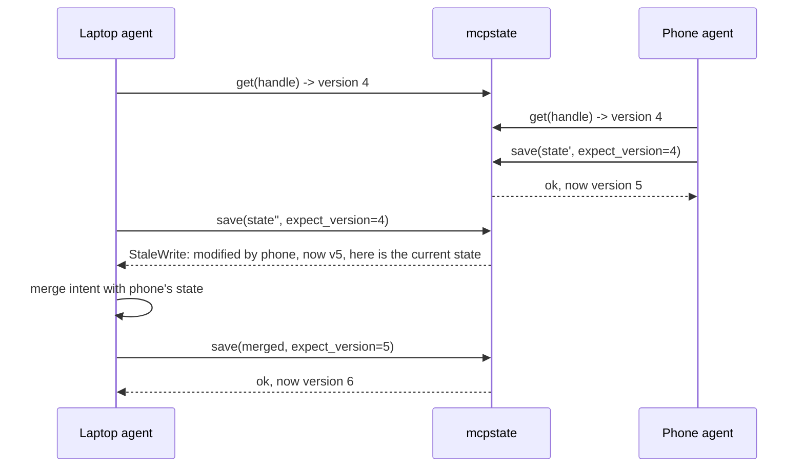
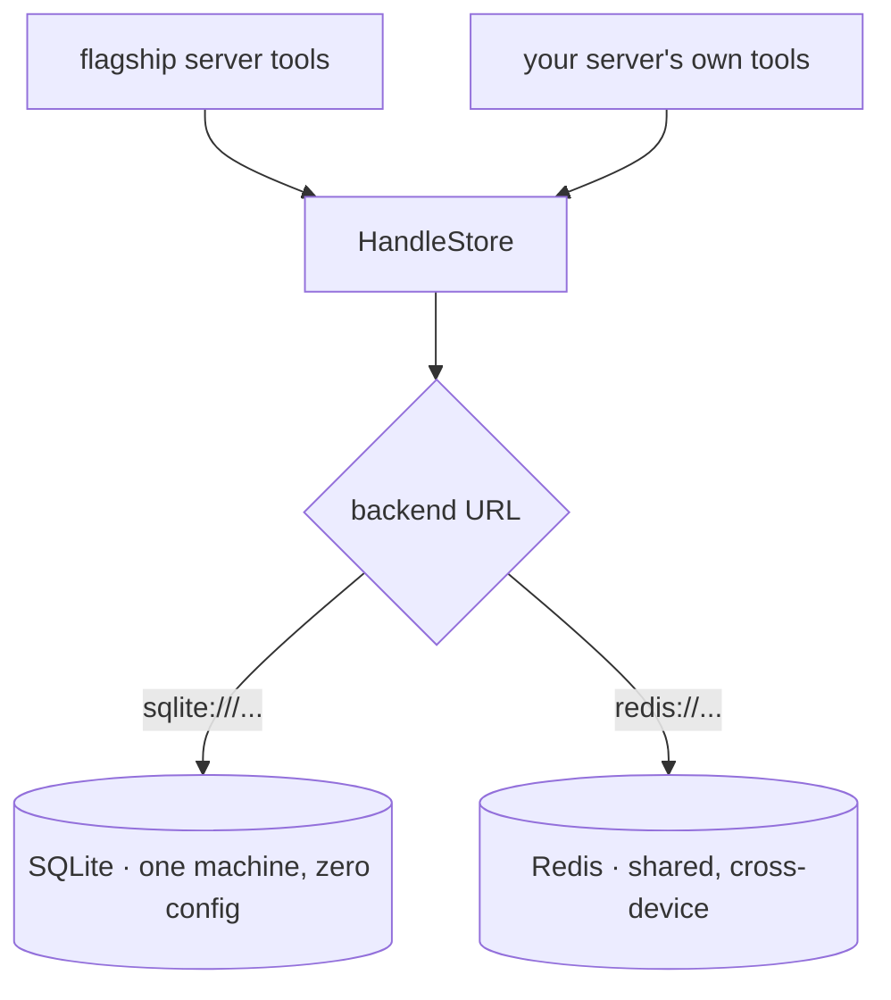

# mcpstate

**Durable, user-keyed state for stateless MCP servers.**

*State that follows the user, not the session.*

[](https://github.com/varmabudharaju/mcpstate/actions/workflows/ci.yml)
[](LICENSE)


`mcpstate` gives MCP agents state that **survives the end of a conversation** —
and a switch to a different client, or a move to a different device. It ships as
a Python library plus a ready-to-run MCP server. Start a research session in
Claude Desktop on your laptop; continue it tomorrow from Claude Code, or from
your phone.

---

## See it work

The demonstration below is real. Each step is a **separate operating-system
process** calling the actual MCP tools, sharing one on-disk backend — so the
state surviving between steps is genuine durability, not a mock. Reproduce it
with [`examples/research_assistant.py`](examples/research_assistant.py); full
walkthrough in [docs/use-case.md](docs/use-case.md).

**A new conversation the next day recovers exactly where you left off:**


**Two devices editing at once — the conflict becomes a merge the agent performs, and no write is lost:**


---

## Why this exists

The MCP specification revision of **2026-07-28** made the protocol stateless:
`Mcp-Session-Id`, the initialize handshake, and SSE resumability were all
removed ([changelog](https://modelcontextprotocol.io/specification/draft/changelog),
[announcement](https://blog.modelcontextprotocol.io/posts/2026-07-28-release-candidate/)).
Sessions fought load balancers; the spec chose horizontal scale.

The spec's official answer for stateful servers is the **handle pattern**: mint
an explicit handle (a `basket_id`, a `research_id`) from a tool, and have the
model pass it back as an ordinary argument. How a server *persists* what a
handle points to is explicitly out of scope — so every stateful MCP server now
needs a durable, user-scoped, expiring handle store, and nothing standardizes
one. `mcpstate` is that store.

## What you can build with it

Any agent whose work is worth keeping between turns:

| You're building | The state that persists |
|---|---|
| A research assistant | collected sources, notes, an evolving outline |
| A shopping / ordering agent | the cart, across laptop and phone |
| A trip planner | an itinerary that grows over days |
| A writing tool | drafts and revisions |
| A tutor | a learner's progress and history |
| A long-running ops workflow | a migration checklist worked over days |

The three axes of continuity all fall out of one idea — state keyed by the
**user**, not the connection:



| Axis | Scenario | Backend |
|---|---|---|
| Across conversations | context filled up; the next chat resumes the work | SQLite (default) |
| Across clients | started in Claude Desktop, continued in Claude Code / Cursor | SQLite (default) |
| Across devices | laptop to phone, desk to server | Redis (shared) |

## Quickstart — end users (the flagship server)

One config entry gives every agent you run durable memory:

```bash
pip install "mcpstate[fastmcp]"
```

```json
{
  "mcpServers": {
    "state": { "command": "mcpstate", "args": ["serve"] }
  }
}
```

The server exposes five tools, written to be driven by a model:

| Tool | What the agent uses it for |
|---|---|
| `state_save` | Create durable state (mints a handle) or update it (versioned) |
| `state_load` | Load state by handle (optionally just a subtree via `path`) |
| `state_list` | "What was I working on?" — list this user's handles |
| `state_patch` | Additive edits that can't conflict (append, set key, merge) |
| `state_delete` | Permanently remove state |

For cross-device reach, point every device at a shared Redis:

```json
{ "args": ["serve", "--backend", "redis://your-redis-host:6379/0"] }
```

## Quickstart — server authors (the library)

```bash
pip install mcpstate
```

```python
from mcpstate import HandleStore, Append, StaleWrite

store = HandleStore.from_url()  # default: sqlite:///~/.mcpstate/state.db

# Mint: create durable state, get back an opaque handle for the model to carry.
handle = store.mint("research", {"sources": [], "notes": ""}, user="alice", ttl_days=7)

# Read: state plus the freshness metadata you need to write it back.
snap = store.get(handle, user="alice")

# Versioned save: declare which version you read. If another session wrote in
# between, you get a StaleWrite carrying the current state — hand it to your
# model to merge and retry.
try:
    store.save(handle, {**snap.state, "notes": "arm64 wins"}, user="alice",
               expect_version=snap.version, writer="laptop/claude-code")
except StaleWrite as conflict:
    current = conflict.details["current"]  # full current snapshot, agent-legible

# Commutative patch: additive edits skip version checks entirely — two devices
# appending at the same moment both land.
store.patch(handle, [Append("sources", "https://arxiv.org/abs/...")],
            user="alice", writer="phone/claude")

# Resume, any session later: what was this user working on?
for info in store.list("alice", kind="research"):
    print(info.handle, info.updated_at, info.last_writer)
```

## The conflict model

`mcpstate` implements **hand-off sync**: state moves between sessions like a
relay baton — one active writer at a time is the expected case, and the rare
overlap is *detected and surfaced*, never silently clobbered.

The design bet: **your client is an LLM.** Traditional sync needs CRDTs because
their clients can't reason about a conflict. An agent can. A losing write gets
back a structured rejection containing the winner's state and an instruction to
re-read and re-apply — and the model performs a *semantic* merge:



Three mechanisms, cheapest first:

1. **Versioned saves** — every snapshot carries a version; `save` declares the
   version it read; a mismatch raises `StaleWrite` with the current snapshot.
2. **Commutative patches** — `Append` / `SetKey` / `DelKey` / `Merge` commute,
   so they apply without version checks and cannot conflict. Most agent-state
   mutations are additive, so most writes never see a conflict at all.
3. **Freshness metadata** — every read returns version, `updated_at`, and
   `last_writer`, so a resuming session knows what changed while it was away.

See [docs/concepts.md](docs/concepts.md) for the relay-baton model, why hand-off
(not CRDTs) is the right v1, and the honest limits.

## Backends



| | SQLite (default) | Redis |
|---|---|---|
| URL | `sqlite:///~/.mcpstate/state.db` | `redis://host:6379/0` |
| Reach | one machine: conversations + clients | anywhere the Redis is reachable |
| Setup | none | `pip install "mcpstate[redis]"` + a Redis |
| Concurrency | atomic compare-and-swap via SQL | optimistic WATCH/MULTI transactions |

Three environment variables configure it: `MCPSTATE_BACKEND` (backend URL, or
`--backend`), `MCPSTATE_USER` (identity for local/stdio; remote servers resolve
the OAuth subject instead), and `MCPSTATE_WRITER` (the `last_writer` label;
defaults to hostname).

## Results & credibility

Everything below is reproducible from a clean checkout with `python3 -m pytest`.

- **97 tests, green on Python 3.11 and 3.12** in CI — with `ruff` and a clean
  `mypy` pass on every push.
- **One backend contract suite runs against both SQLite and Redis**, so the two
  backends are held to identical semantics — not tested separately and hoped to
  match.
- **Concurrency is proven, not assumed.** Threaded race tests assert exactly one
  writer wins a contended save while every commutative patch lands; the CAS
  engine was verified correct across separate OS processes on one WAL file.
  Under a 64-way patch contention stress test: **0 lost writes, 0 spurious
  failures** (3,200 concurrent patches, all landed).
- **Hardened against an adversarial review.** Four independent reviewers attacked
  user isolation, injection/resource-exhaustion, concurrency, and API contracts.
  The core CAS engine and user-scoping were confirmed sound; every real finding
  was fixed with a regression test — HTTP fail-closed identity, issuer-scoped
  users, TTL-overflow and input validation, credential redaction, a 1 MiB state
  guard, and agent-legible structured errors on every failure path.
- **Zero required dependencies** in the core library (`redis` and `fastmcp` are
  optional extras); ships `py.typed`.

Security defaults worth knowing: state is capped at 1 MiB (configurable;
oversized saves return a structured `state_too_large`), credentials never appear
in error messages, and `mcpstate serve --transport http` **fails closed** — it
refuses unauthenticated callers unless you pass `--allow-anonymous`, so a
misconfigured server can't silently merge every user's state. Multi-user
identity comes from FastMCP OAuth (issuer-scoped).

## API reference

### `HandleStore`

| Method | Behavior | Raises |
|---|---|---|
| `from_url(url=None)` | Construct from a backend URL; `None` uses the SQLite default | `ValueError`, `BackendError` |
| `mint(kind, state, *, user, ttl_days=None, writer=None) -> str` | Create state, return opaque handle `{kind}_{8 chars}` | `ValueError`, `StateTooLarge` |
| `get(handle, *, user) -> Snapshot` | State + version + timestamps + last writer | `HandleNotFound`, `HandleExpired` |
| `save(handle, state, *, user, expect_version, writer=None) -> Snapshot` | Versioned full replace | `StaleWrite`, `HandleNotFound`, `HandleExpired`, `StateTooLarge` |
| `patch(handle, ops, *, user, writer=None) -> Snapshot` | Apply commutative ops; no version needed | `PatchError`, `HandleNotFound`, `HandleExpired` |
| `list(user, *, kind=None, include_expired=False) -> list[HandleInfo]` | Metadata only, most recently updated first | — |
| `revoke(handle, *, user)` | Delete | `HandleNotFound` |
| `sweep(user) -> int` | Physically remove expired records | — |

### Patch ops

| Op | Wire form (for `state_patch`) |
|---|---|
| `Append(path, value)` | `{"op": "append", "path": "sources", "value": ...}` |
| `SetKey(path, key, value)` | `{"op": "set_key", "path": "profile", "key": "name", "value": ...}` |
| `DelKey(path, key)` | `{"op": "del_key", "path": "", "key": "draft"}` |
| `Merge(mapping)` | `{"op": "merge", "mapping": {...}}` |

`path` is a dotted path into the state (`"profile.tags"`); `""` is the root.

Every error carries `.code` and `.to_payload()` — a structured dict written for
a model to read: `stale_write` includes the full current snapshot;
`handle_expired` is distinguished from `handle_not_found`.

## Roadmap

Deliberately out of v1, in rough order: append-only changelog and
`changes_since(handle, version)`; advisory activity leases; merge hooks / CRDTs
behind the same handle API; push via MCP resource subscriptions; a Postgres
backend and a non-Python sidecar.

## Development

```bash
python3 -m pip install -e ".[dev]"
python3 -m pytest        # 97 tests
python3 -m ruff check src tests
python3 -m mypy src/mcpstate
```

MIT licensed.
