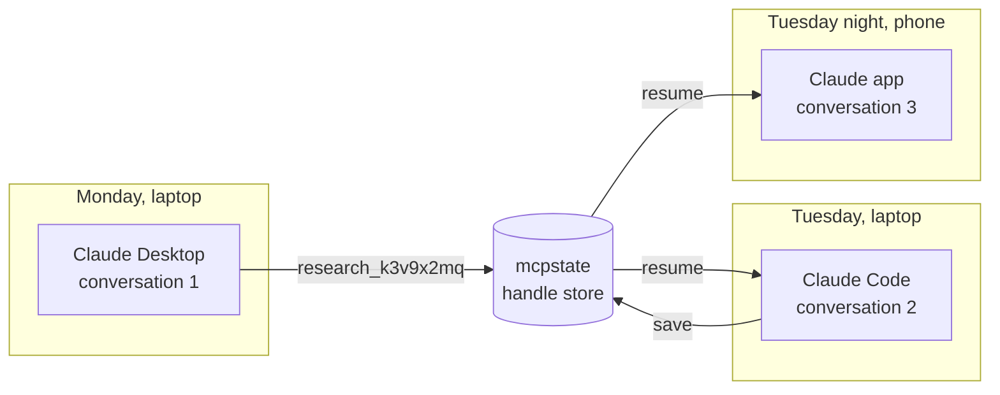
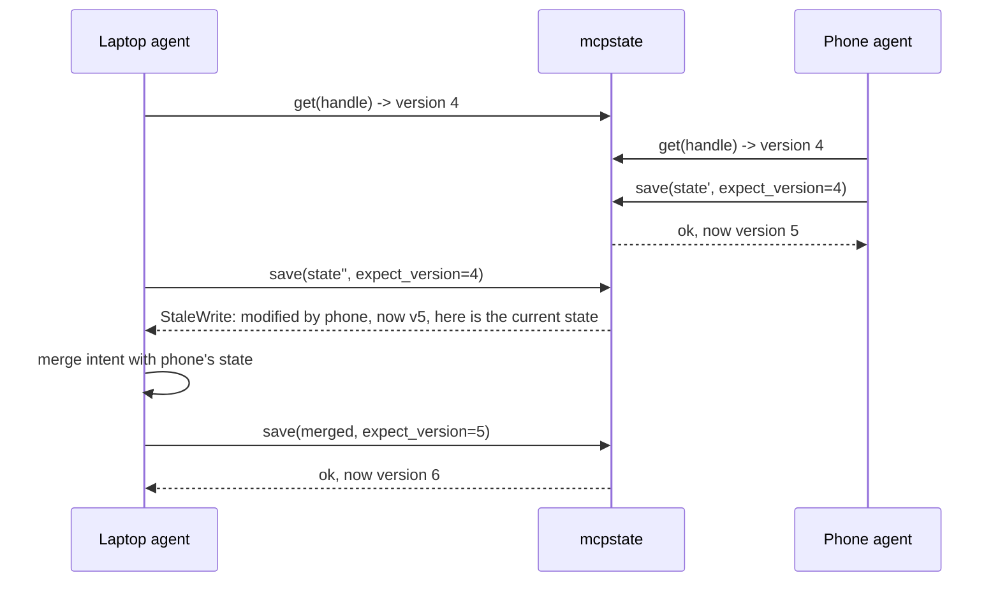
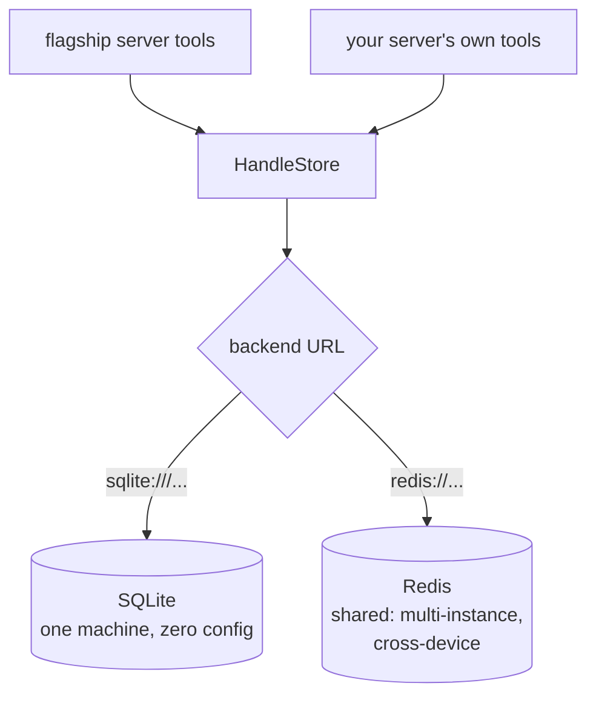

# mcpstate

**Durable, user-keyed state for stateless MCP servers.**

*State that follows the user, not the session.*

`mcpstate` is a Python library — plus a ready-to-run MCP server — that gives
agents state which survives the end of a conversation, a switch to a different
MCP client, or a move to a different device. Start a research session in
Claude Desktop on your laptop; continue it tomorrow from Claude Code, or from
your phone.

## Why this exists

The MCP specification revision of **2026-07-28** made the protocol stateless:
`Mcp-Session-Id`, the initialize handshake, and SSE resumability were all
removed ([changelog](https://modelcontextprotocol.io/specification/draft/changelog),
[announcement](https://blog.modelcontextprotocol.io/posts/2026-07-28-release-candidate/)).
Sessions fought load balancers; the spec chose horizontal scale.

The spec's official answer for stateful servers is the **handle pattern**:
mint an explicit handle (a `basket_id`, a `research_id`) from a tool, and have
the model pass it back as an ordinary argument. How a server *persists* what a
handle points to is explicitly out of scope — every stateful MCP server now
needs a durable, user-scoped, expiring handle store, and nothing standardizes
one.

`mcpstate` is that store: minting, persistence, versioning, TTL, identity
scoping, and conflict handling behind one small API — with the storage backend
deciding how far your state can travel.

## The three axes of continuity



| Axis | Scenario | Backend needed |
|---|---|---|
| Across conversations | Context window filled up; next conversation resumes the work | SQLite (default, zero config) |
| Across clients | Started in Claude Desktop, continuing in Claude Code or Cursor | SQLite (default, zero config) |
| Across devices | Laptop to phone, desk to server | Redis (any shared instance) |

The first axis is the everyday one: today, every MCP server forgets everything
between conversations. With `mcpstate`, work products survive by default.

## Quickstart: end users (the flagship server)

Install and add one entry to your MCP client config — every agent you run
gains durable memory:

```bash
pip install "mcpstate[fastmcp]"
```

```json
{
  "mcpServers": {
    "state": {
      "command": "mcpstate",
      "args": ["serve"]
    }
  }
}
```

The server exposes five tools:

| Tool | What the agent uses it for |
|---|---|
| `state_save` | Create durable state (mints a handle) or update it (versioned) |
| `state_load` | Load state by handle (optionally just a subtree via `path`) |
| `state_list` | "What was I working on?" — list this user's handles |
| `state_patch` | Additive edits that can never conflict (append, set key, merge) |
| `state_delete` | Permanently remove state |

For cross-device reach, point every device at a shared Redis:

```json
{ "args": ["serve", "--backend", "redis://your-redis-host:6379/0"] }
```

## Quickstart: server authors (the library)

```bash
pip install mcpstate
```

```python
from mcpstate import HandleStore, Append, StaleWrite

store = HandleStore.from_url()  # default: sqlite:///~/.mcpstate/state.db

# Mint: create durable state, get back an opaque handle for the model to carry.
handle = store.mint("research", {"sources": [], "notes": ""}, user="alice", ttl_days=7)

# Read: state plus the freshness metadata you need to write it back.
snap = store.get(handle, user="alice")

# Versioned save: declare which version you read. If another session wrote
# in between, you get a StaleWrite carrying the current state - hand it to
# your model to merge and retry.
try:
    store.save(handle, {**snap.state, "notes": "arm64 wins"}, user="alice",
               expect_version=snap.version, writer="laptop/claude-code")
except StaleWrite as conflict:
    current = conflict.details["current"]  # full current snapshot, agent-legible

# Commutative patch: additive edits skip version checks entirely - two
# devices appending at the same moment both land.
store.patch(handle, [Append("sources", "https://arxiv.org/abs/...")],
            user="alice", writer="phone/claude")

# Resume, any session later: what was this user working on?
for info in store.list("alice", kind="research"):
    print(info.handle, info.updated_at, info.last_writer)
```

## The conflict model

`mcpstate` implements **hand-off sync**: state moves between sessions like a
relay baton — one active writer at a time is the expected case, and the rare
overlap is *detected and surfaced*, never silently clobbered.

The design bet: **your client is an LLM.** Traditional sync systems need
CRDTs because their clients cannot reason about a conflict. An agent can. So a
losing write gets back a structured rejection containing the winner's state
and an instruction to re-read and re-apply — and the model performs a
*semantic* merge, which is better than a structural one:



Three mechanisms, cheapest first:

1. **Versioned saves** — every snapshot carries a version; `save` declares the
   version it read; mismatches raise `StaleWrite` with the current snapshot
   inside.
2. **Commutative patches** — `Append` / `SetKey` / `DelKey` / `Merge` commute
   with each other, so they apply without version checks and cannot conflict.
   Most agent-state mutations are additive; most writes never see a conflict.
3. **Freshness metadata** — every read returns version, `updated_at`, and
   `last_writer`, so a resuming session knows what happened while it was away.

## Backends



| | SQLite (default) | Redis |
|---|---|---|
| URL | `sqlite:///~/.mcpstate/state.db` | `redis://host:6379/0` |
| Reach | one machine: conversations + clients | anywhere the Redis is reachable |
| Setup | none | `pip install "mcpstate[redis]"` + a Redis |
| Concurrency | atomic compare-and-swap via SQL | optimistic WATCH/MULTI transactions |

Configuration is three environment variables:

- `MCPSTATE_BACKEND` — backend URL (or pass `--backend` to `mcpstate serve`).
- `MCPSTATE_USER` — identity override for local/stdio use. Remote servers
  running with OAuth resolve the user from the access token instead; stdio
  servers default to `"local"`.
- `MCPSTATE_WRITER` — the label recorded as `last_writer` on every write
  (e.g. `laptop/claude-code`); defaults to the machine's hostname, so
  cross-device hand-offs are attributable out of the box.

Security defaults worth knowing: states are capped at 1 MiB
(`HandleStore(max_state_bytes=...)` to change; oversized saves get a
structured `state_too_large` error), credentials never appear in error
messages, and `mcpstate serve --transport http` has no authentication of its
own — keep it on localhost or behind an authenticating proxy; multi-user
identity requires running under FastMCP OAuth.

## API reference

### `HandleStore`

| Method | Behavior | Raises |
|---|---|---|
| `from_url(url=None)` | Construct from a backend URL; `None` uses the SQLite default | `ValueError`, `BackendError` |
| `mint(kind, state, *, user, ttl_days=None, writer=None) -> str` | Create state, return opaque handle `{kind}_{8 chars}` | `ValueError` |
| `get(handle, *, user) -> Snapshot` | State + version + timestamps + last writer | `HandleNotFound`, `HandleExpired` |
| `save`/`mint`/`patch` size guard | States over `max_state_bytes` (default 1 MiB) are rejected | `StateTooLarge` |
| `save(handle, state, *, user, expect_version, writer=None) -> Snapshot` | Versioned full replace; returns the new snapshot | `StaleWrite`, `HandleNotFound`, `HandleExpired` |
| `patch(handle, ops, *, user, writer=None) -> Snapshot` | Apply commutative ops; no version needed | `PatchError`, `HandleNotFound`, `HandleExpired` |
| `list(user, *, kind=None, include_expired=False) -> list[HandleInfo]` | Metadata only, most recently updated first | — |
| `revoke(handle, *, user)` | Delete | `HandleNotFound` |
| `sweep(user) -> int` | Physically remove expired records | — |

### Patch ops

| Op | Wire form (for `state_patch`) |
|---|---|
| `Append(path, value)` | `{"op": "append", "path": "sources", "value": ...}` |
| `SetKey(path, key, value)` | `{"op": "set_key", "path": "profile", "key": "name", "value": ...}` |
| `DelKey(path, key)` | `{"op": "del_key", "path": "", "key": "draft"}` |
| `Merge(mapping)` | `{"op": "merge", "mapping": {...}}` |

`path` is a dotted path into the state (`"profile.tags"`); `""` is the root.

### Errors

Every error carries `.code` and `.to_payload()` — a structured dict written
for a model to read: `stale_write` includes the full current snapshot;
`handle_expired` is distinguished from `handle_not_found` and says when it
expired and what the TTL was.

## Design notes

Read [docs/concepts.md](docs/concepts.md) for the full conceptual story:
the relay-baton model, why hand-off (not CRDTs) is the right v1 for agent
systems, the conflict ladder, and the honest limits.

## Roadmap

Deliberately out of v1, in rough order:

- Append-only changelog and `changes_since(handle, version)` — richer resume
  UX and the substrate for op-based merging.
- Advisory activity leases — "another session is working on this right now."
- Merge hooks / CRDTs behind the same handle API — true concurrent sync.
- Push via MCP resource subscriptions, where client support allows.
- Postgres backend; sidecar service for non-Python servers.

## Development

```bash
python3 -m pip install -e ".[dev]"
python3 -m pytest
```

MIT licensed.
