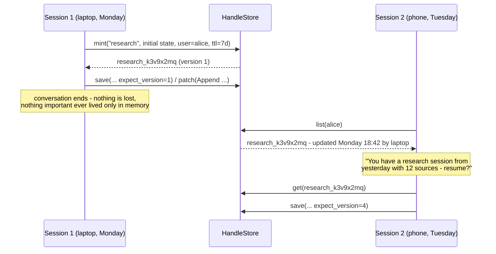

# Concepts: hand-off sync and the handle store

This document explains the ideas behind `mcpstate` — what problem it solves,
the mental model it is built on, and where its limits are. The README covers
*how* to use it; this covers *why it works this way*.

## The problem: MCP forgot how to remember

MCP servers historically kept state in memory, tied to a transport session.
That design died twice:

1. **In practice** — a session ends when the conversation ends. Close the
   chat, and the cart, the research notes, the half-built itinerary are gone.
   Different clients (Claude Desktop, Claude Code, Cursor) never shared
   anything even on the same machine.
2. **In the spec** — the 2026-07-28 revision removed sessions from the
   protocol entirely, because per-session server state fights load balancers
   and horizontal scaling. The blessed replacement is the *handle pattern*:

> Mint an explicit handle (a `basket_id`, a `browser_id`) from a tool and
> have the model pass it back as an ordinary argument.

The spec deliberately says nothing about how a server stores what a handle
refers to. That storage layer — durable, scoped to a *user* rather than a
dead session id, with expiry and conflict rules — is what `mcpstate` provides.

## The mental model: a relay baton

Hand-off sync treats state like a **relay baton, not a shared whiteboard**.
At any moment, one agent session is "holding" a piece of state. When you stop
working, the baton doesn't vanish with the session — it rests in the store,
keyed by who you are. When you show up again — any device, any client, any
conversation — it's offered back, and you keep going.

Sync here means **the state travels; the sessions don't overlap.** That single
assumption is what keeps the system simple, and it matches how people actually
use agents: one conversation at a time, moving between contexts.



Three properties fall out of the mechanics:

- **Resume is free.** There is no export step, no snapshotting ceremony at
  hand-off time. Resume-ability is a property of how the state was stored all
  along.
- **Identity is the key, not the connection.** State is scoped to a user
  string (an OAuth subject for remote servers, `"local"` for stdio). Handles
  from a dead session id would be orphans; handles keyed by user follow you.
- **Reach is a backend choice.** The same code gives one-machine continuity
  on SQLite and cross-device continuity on a shared Redis. Server logic never
  changes.

## The conflict ladder

What happens when two sessions *do* overlap? A traditional sync engine has
two options: last-write-wins (silent data loss) or CRDTs (a mini-Firebase of
merge machinery). `mcpstate` takes a third road built on one observation:

**The client is an LLM.** A Dropbox client cannot reason about a conflict.
An agent can re-read, understand both versions, and re-apply its *intent*.
So conflict resolution becomes a prompt, not a data structure.

The ladder, cheapest rung first:

### Rung 1: versioned saves (detect, don't merge)

Every snapshot has a version. A save declares the version it read:

```text
save(handle, new_state, expect_version=4)
        │
        ├─ store still at v4 ──> write wins, now v5
        └─ store moved to v5 ──> StaleWrite:
             "State was modified by 'phone/claude' at 18:42 (now version 5,
              you expected 4). Re-read the current state below and re-apply
              your change on top of it."
             + the full current snapshot, in the payload
```

For a normal program that's an error. For an agent it's an *instruction* —
and the merge it performs is semantic ("keep both sources, dedupe the one we
both found"), which no CRDT can do.

### Rung 2: commutative patches (make conflicts impossible)

Most agent-state mutations are additive: append a source, set a key, merge a
mapping. Those operations commute — applied in either order, the result is the
same. So `patch()` skips version checks entirely: two devices appending at
the same moment both land, no conflict possible. In practice this makes
genuine `StaleWrite` rejections rare: they only occur on true same-field
contention via full saves.

One precision worth stating: *append* is conflict-free in the strong sense —
both values end up in the list. *set_key* and *merge* are conflict-free only
mechanically: both writes land, but if two sessions target the **same key**,
the later one wins that key. The freshness metadata (`version`,
`last_writer`) makes the winner visible rather than silent.

### Rung 3: freshness on every read

Every `get` returns version, `updated_at`, and `last_writer`. A session that
resumes after time away sees at a glance that (and by whom) the state moved.
A model only perceives the world at tool-call boundaries anyway — so making
every read surface change legibly is worth more than push notifications that
arrive when no one is home to read them.

### Rungs above (roadmap, not v1)

- **Changelog** — an append-only journal of ops enables precise
  "what changed since version N" answers and is the substrate for op-based
  merging.
- **Advisory leases** — "another session touched this 90 seconds ago" turns
  surprise races into informed choices.
- **Merge hooks / CRDTs** — true concurrent multi-writer sync, behind the
  same handle API, if live collaboration ever becomes the point.

## Why not CRDTs in v1

Concurrent sync is a different-sized project: conflict-free data types or
per-field merge policies, tombstones, vector versions, change notification.
It is only worth building when *simultaneously live* multi-device agents are
the headline use case. They aren't — yet. Hand-off covers the real usage
pattern, ships now, and versioned saves plus the (future) op journal are the
honest foundation for concurrent sync later, without breaking the API servers
wrote against.

## Honest limits

- Two simultaneously-active writers do not get automatic merging: the later
  full save is rejected and must re-apply (agent-mediated), and only patch
  ops land unconditionally.
- Patch ops are mechanically conflict-free, not always semantically: two
  sessions `set_key`/`merge`-ing the same key resolve last-write-wins for
  that key (append never loses data).
- No live push: an idle session learns about changes at its next read.
- Cross-device reach requires a network-reachable backend (Redis). A local
  SQLite file cannot sync machines by itself.

These are exactly the promises the roadmap rungs exist to add — v1 prefers
visible, legible limits over invisible complexity.
