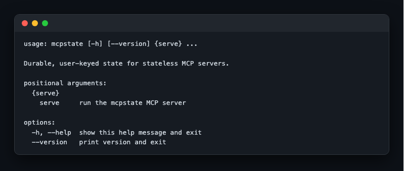
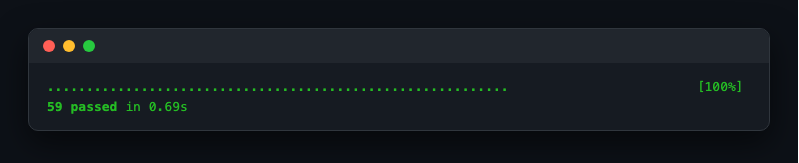
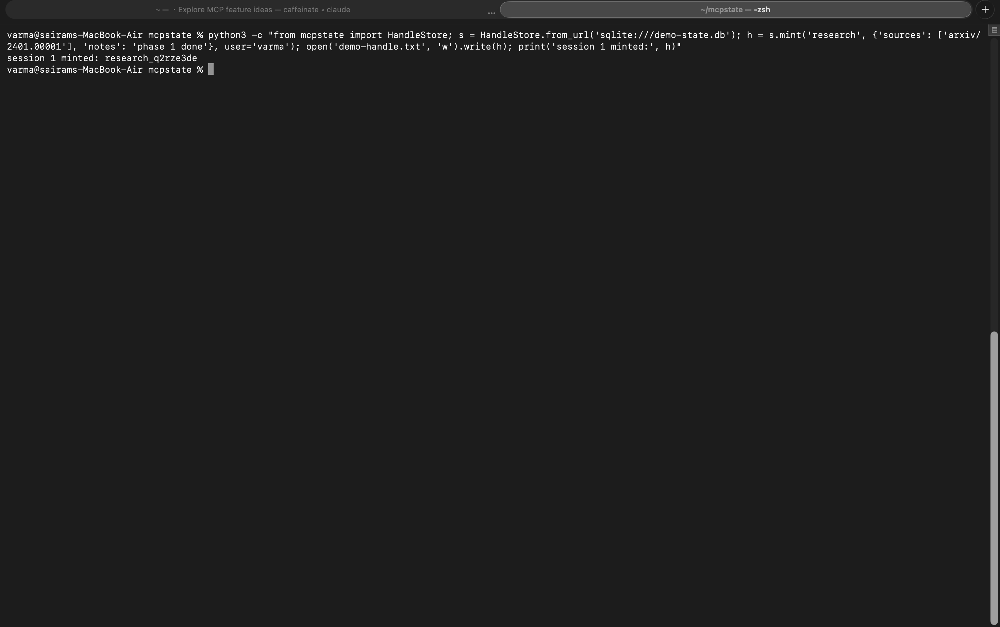
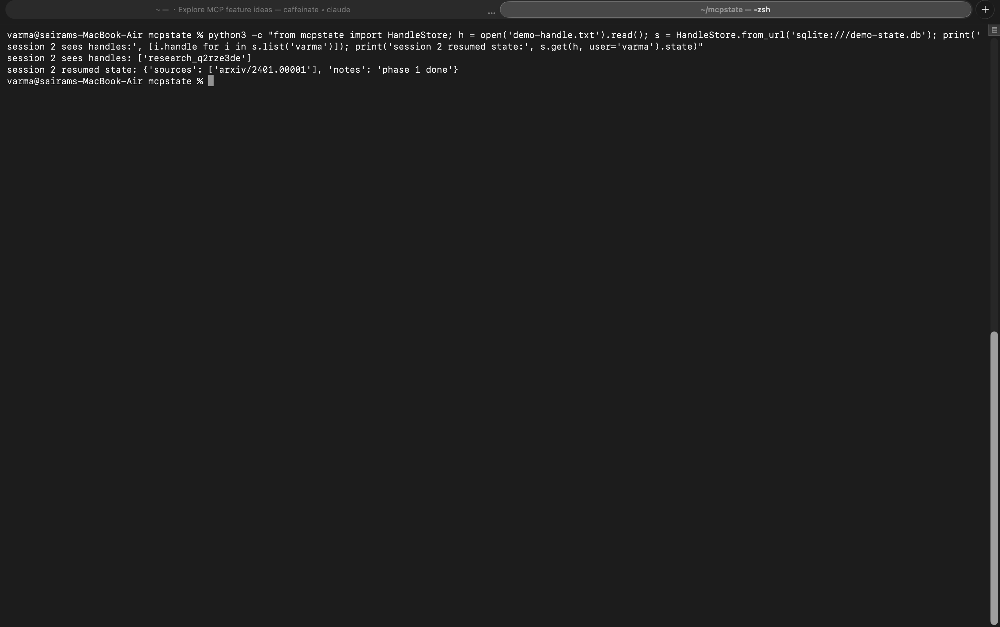

# Test evidence

Real screenshots captured with [shotlist](https://pypi.org/project/shotlist/)
(`shotlist run` regenerates them). Assertion-level coverage lives in `tests/`
(59 tests: backend contract suite on SQLite and Redis, concurrency race
proofs, FastMCP in-memory integration, CLI).

## CLI

The installed `mcpstate` console script with the `serve` subcommand.

## Test suite

`python3 -m pytest -q` — the full suite green.

## Hand-off sync, demonstrated

Session 1: a Python process mints a `research` handle and persists state
through the default SQLite backend.

Session 2: a completely separate process lists the user's handles, finds the
research session, and resumes its exact state — the relay-baton hand-off that
is the core promise of the library.
