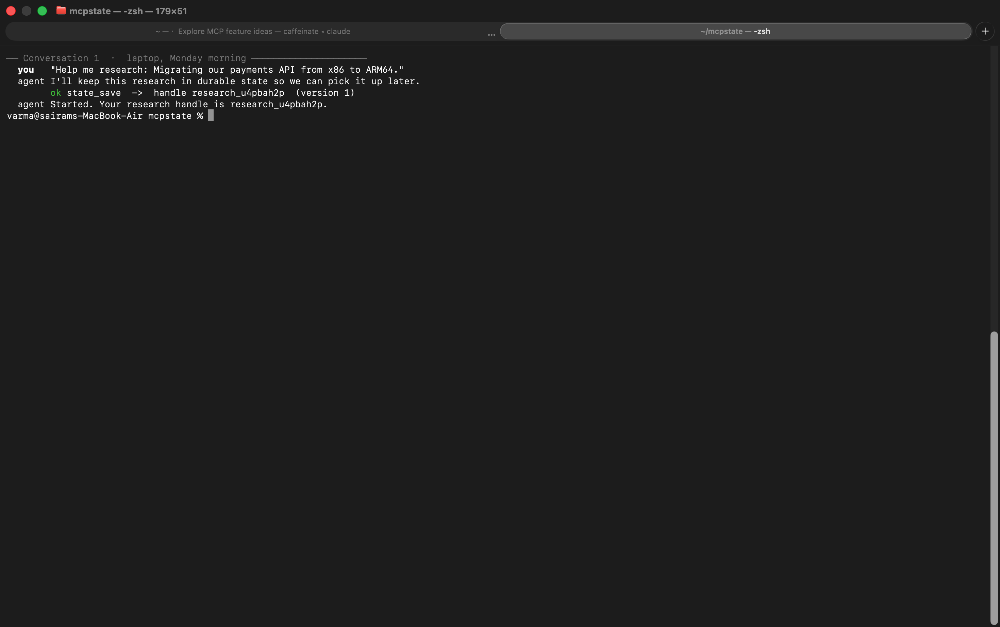
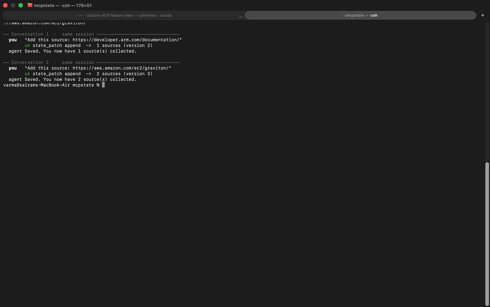
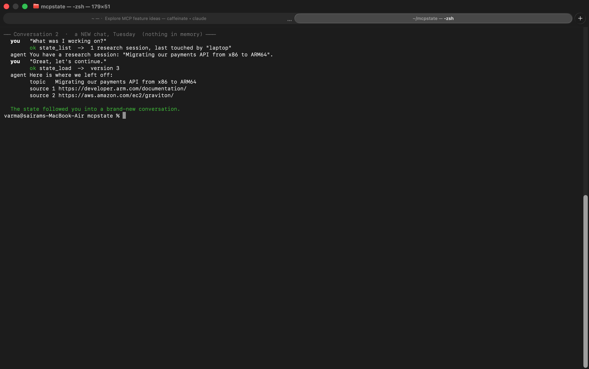
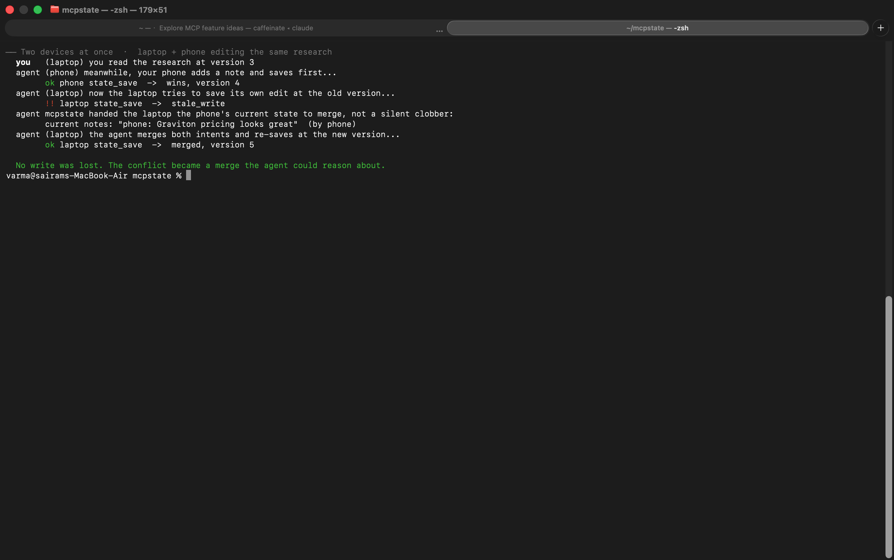

# Use case: a research assistant that remembers across conversations

The single clearest thing mcpstate buys you: **an agent that does not forget
when the conversation ends.** Today every MCP server loses its state between
chats. With mcpstate, work products persist and follow the user.

The demo below is real. It is driven by
[`examples/research_assistant.py`](../examples/research_assistant.py), which
calls the actual flagship MCP tools (`state_save`, `state_load`, `state_list`,
`state_patch`) through an in-process MCP client. **Each step is a separate
operating-system process** sharing one SQLite file, so nothing is held in
memory between commands — the state surviving from one step to the next is
genuine durability, not a trick.

Reproduce it yourself:

```bash
python3 examples/research_assistant.py start
python3 examples/research_assistant.py source "https://developer.arm.com/documentation/"
python3 examples/research_assistant.py source "https://aws.amazon.com/ec2/graviton/"
python3 examples/research_assistant.py resume     # a brand-new conversation
python3 examples/research_assistant.py conflict   # two devices at once
```

## 1. Conversation 1 — start the research

The assistant mints a durable handle and saves the initial state.



## 2. Still conversation 1 — collect sources

Two sources are appended with commutative patches (no version juggling, and
two devices could append at once without conflict).



## 3. Conversation 2 — a brand-new chat, nothing in memory

This is the payoff. A completely fresh process — a new conversation the next
day — asks "what was I working on?", finds the research session, and recovers
its exact state.



## 4. Two devices at once — conflict becomes a merge

The differentiating feature. The phone saves first; the laptop's save at the
stale version is rejected — but instead of a silent clobber, mcpstate hands the
laptop the phone's current state to merge. The agent reconciles both intents
and re-saves. **No write is lost, and the conflict is something the model can
reason about.**



## What this proves

- State is **durable** — it survives across independent processes/conversations.
- State is **user-keyed** — `state_list` answers "what was I working on?" for
  the user, not a dead session.
- Concurrent edits are **safe and legible** — hand-off sync turns a race into a
  merge the agent performs, rather than losing data or requiring CRDTs.

Point the same flagship server at a shared Redis backend
(`--backend redis://…`) and the exact same flow spans physical devices.
